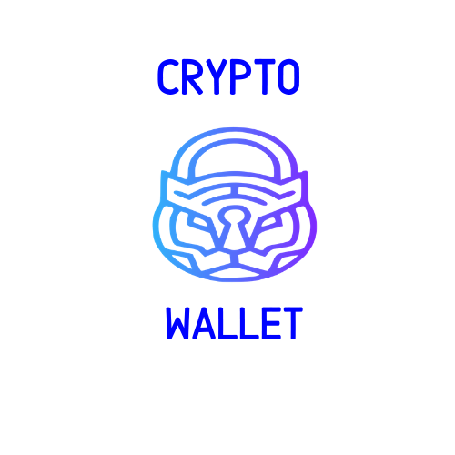

# CryptoWallet

## Getting Started

- `npm install`: Install dependencies
- `npm run start`: Run server
### Prerequisites

You need to have installed > NodeJS 8.x and NPM.

## Built With ❤
### Front-End
 
* [REACT](https://reactjs.org/)
* [MATERIAL-UI](https://material-ui.com/)
 
## Author

* **Analin Flores** - - [Any28Flo](https://github.com/Any28Flo)

## License

This project is licensed under the MIT License 

## Acknowledgments

* Inspiration
* Our TA's (Raul, Kain, JP)